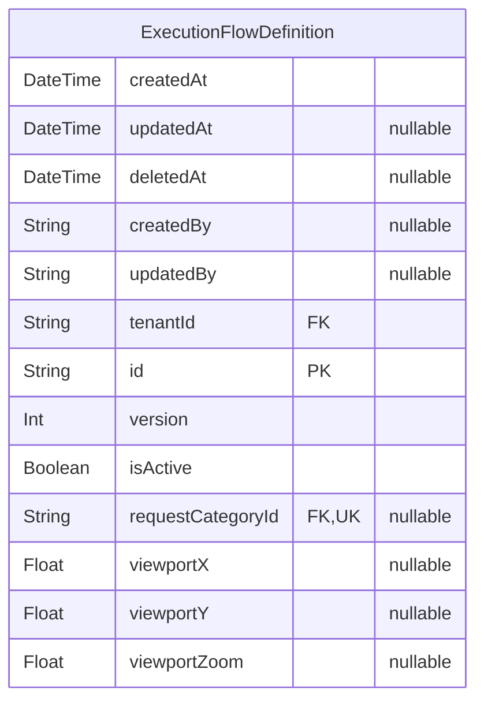
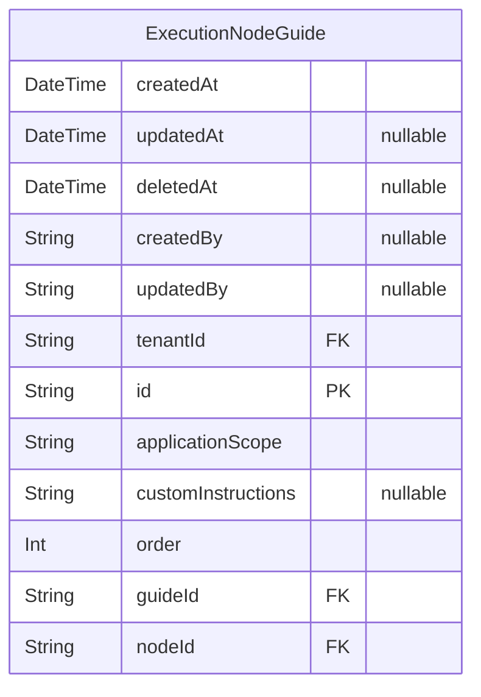
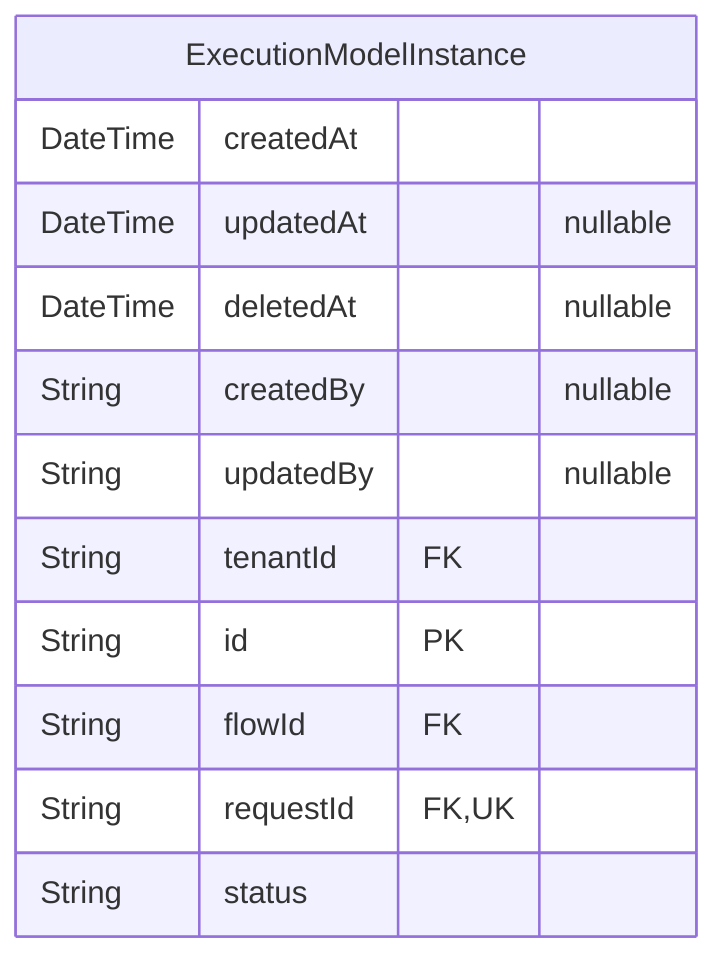
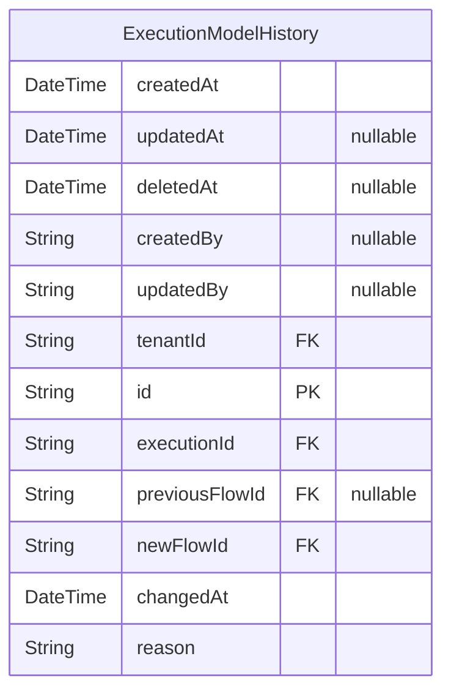

# Request Admin ERD

> Generated by [`prisma-markdown`](https://github.com/samchon/prisma-markdown)

- [CoreWorkflow](#coreworkflow)
- [Documentation](#documentation)
- [RuntimeExecution](#runtimeexecution)
- [VersionHistory](#versionhistory)
- [default](#default)

## CoreWorkflow



### `ExecutionFlowDefinition`

# Workflow Execution System

## Core Workflow Definitions
@namespace CoreWorkflow
@erd CoreWorkflow
Represents a versioned workflow template containing nodes and edges

Relationships:
╠═► nodes: Contains all component nodes
╠═► edges: Defines transitions between nodes
╠═► executions: Runtime instances using this template
╚═► requestCategory: Business process classification

Properties as follows:

- `createdAt`:
- `updatedAt`:
- `deletedAt`:
- `createdBy`:
- `updatedBy`:
- `tenantId`:
- `id`:
- `version`:
- `isActive`:
- `requestCategoryId`:
- `viewportX`:
- `viewportY`:
- `viewportZoom`:

## Documentation



### `ExecutionNodeGuide`

## Documentation System
@namespace Documentation
@erd Documentation
Links procedural guides to workflow nodes

Properties as follows:

- `createdAt`:
- `updatedAt`:
- `deletedAt`:
- `createdBy`:
- `updatedBy`:
- `tenantId`:
- `id`:
- `applicationScope`:
- `customInstructions`:
- `order`:
- `guideId`:
- `nodeId`:

## RuntimeExecution



### `ExecutionModelInstance`

## Runtime Execution Tracking
@namespace RuntimeExecution
@erd RuntimeExecution
Concrete instance of workflow execution

Properties as follows:

- `createdAt`:
- `updatedAt`:
- `deletedAt`:
- `createdBy`:
- `updatedBy`:
- `tenantId`:
- `id`:
- `flowId`:
- `requestId`:
- `status`:

## VersionHistory



### `ExecutionModelHistory`

## Version History Tracking
@namespace VersionHistory
@erd VersionHistory
Records workflow template migrations during execution

Properties as follows:

- `createdAt`:
- `updatedAt`:
- `deletedAt`:
- `createdBy`:
- `updatedBy`:
- `tenantId`:
- `id`:
- `executionId`:
- `previousFlowId`:
- `newFlowId`:
- `changedAt`:
- `reason`:

## default

```mermaid
erDiagram
"Tenant" {
  DateTime createdAt
  DateTime updatedAt "nullable"
  DateTime deletedAt "nullable"
  String createdBy "nullable"
  String updatedBy "nullable"
  String id PK
  String name
  String slug UK "nullable"
  String logo "nullable"
  String metadata "nullable"
  String websiteUrl "nullable"
  String title "nullable"
  String description "nullable"
  String primaryColor "nullable"
  String secondaryColor "nullable"
  String contactEmail "nullable"
  String contactPhone "nullable"
  String address "nullable"
}
"UserTenant" {
  DateTime createdAt
  DateTime updatedAt "nullable"
  DateTime deletedAt "nullable"
  String createdBy "nullable"
  String updatedBy "nullable"
  String tenantId FK
  String id PK
  Boolean isActive
  Boolean isTermAccepted
  DateTime joinedAt
  Boolean isTwoFactorRequired
  String role
  String userId FK
  String personId "nullable"
}
"InvitationTenant" {
  DateTime createdAt
  DateTime updatedAt "nullable"
  DateTime deletedAt "nullable"
  String createdBy "nullable"
  String updatedBy "nullable"
  String tenantId FK
  String id PK
  String email
  String role "nullable"
  String status
  DateTime expiresAt
  String inviterId FK
}
"Subscription" {
  String id PK
  String tenantId FK
  String planId FK
  DateTime startDate
  DateTime endDate
  String status
  Boolean isLifetime
  DateTime createdAt
  DateTime updatedAt
}
"Plan" {
  String id PK
  String name
  String description
  Float price
  Int durationInDays "nullable"
  DateTime createdAt
  DateTime updatedAt
}
"PlanFeature" {
  String id PK
  String planId FK
  String featureId FK
  Int dailyLimit "nullable"
  Int totalLimit "nullable"
  String resetInterval
  DateTime createdAt
  DateTime updatedAt
}
"UsageTracking" {
  String id PK
  String tenantId FK
  String featureName
  Int usageCount
  DateTime lastUsedAt "nullable"
  DateTime createdAt
  DateTime updatedAt
}
"Payment" {
  String id PK
  String subscriptionId FK
  Float amount
  DateTime paymentDate
  String paymentMethod
  String status
  DateTime createdAt
  DateTime updatedAt
}
"user" {
  String id PK
  String name
  String email UK
  Boolean emailVerified
  String image "nullable"
  DateTime createdAt
  DateTime updatedAt
  Boolean twoFactorEnabled "nullable"
  String role "nullable"
  Boolean banned "nullable"
  String banReason "nullable"
  DateTime banExpires "nullable"
  String phoneNumber "nullable"
  Boolean phoneNumberVerified "nullable"
  Boolean isAnonymous "nullable"
  Boolean isGlobalAdmin "nullable"
  String username "nullable"
  String displayUsername "nullable"
}
"session" {
  String id PK
  DateTime expiresAt
  String token UK
  DateTime createdAt
  DateTime updatedAt
  String ipAddress "nullable"
  String userAgent "nullable"
  String userId FK
  String activeTenantId "nullable"
  String impersonatedBy "nullable"
}
"account" {
  String id PK
  String accountId UK
  String providerId
  String userId FK
  String accessToken "nullable"
  String refreshToken "nullable"
  String idToken "nullable"
  DateTime accessTokenExpiresAt "nullable"
  DateTime refreshTokenExpiresAt "nullable"
  String scope "nullable"
  String password "nullable"
  DateTime createdAt
  DateTime updatedAt
}
"verification" {
  String id PK
  String identifier
  String value
  DateTime expiresAt
  DateTime createdAt "nullable"
  DateTime updatedAt "nullable"
}
"twoFactor" {
  String id PK
  String secret
  String backupCodes
  String userId FK
}
"jwks" {
  String id PK
  String publicKey
  String privateKey
  DateTime createdAt
}
"ssoProvider" {
  String id PK
  String issuer
  String oidcConfig "nullable"
  String samlConfig "nullable"
  String userId FK "nullable"
  String providerId UK
  String tenantId "nullable"
  String domain
}
"oauthApplication" {
  String id PK
  String name "nullable"
  String icon "nullable"
  String metadata "nullable"
  String clientId UK "nullable"
  String clientSecret "nullable"
  String redirectURLs "nullable"
  String type "nullable"
  Boolean disabled "nullable"
  String userId "nullable"
  DateTime createdAt "nullable"
  DateTime updatedAt "nullable"
}
"oauthAccessToken" {
  String id PK
  String accessToken UK "nullable"
  String refreshToken UK "nullable"
  DateTime accessTokenExpiresAt "nullable"
  DateTime refreshTokenExpiresAt "nullable"
  String clientId "nullable"
  String userId "nullable"
  String scopes "nullable"
  DateTime createdAt "nullable"
  DateTime updatedAt "nullable"
}
"oauthConsent" {
  String id PK
  String clientId "nullable"
  String userId "nullable"
  String scopes "nullable"
  DateTime createdAt "nullable"
  DateTime updatedAt "nullable"
  Boolean consentGiven "nullable"
}
"apikey" {
  String id PK
  String name "nullable"
  String start "nullable"
  String prefix "nullable"
  String key
  String userId FK
  Int refillInterval "nullable"
  Int refillAmount "nullable"
  DateTime lastRefillAt "nullable"
  Boolean enabled "nullable"
  Boolean rateLimitEnabled "nullable"
  Int rateLimitTimeWindow "nullable"
  Int rateLimitMax "nullable"
  Int requestCount "nullable"
  Int remaining "nullable"
  DateTime lastRequest "nullable"
  DateTime expiresAt "nullable"
  DateTime createdAt
  DateTime updatedAt
  String permissions "nullable"
  String metadata "nullable"
}
"passkey" {
  String id PK
  String name "nullable"
  String publicKey
  String userId FK
  String credentialID
  Int counter
  String deviceType
  Boolean backedUp
  String transports "nullable"
  DateTime createdAt "nullable"
}
"Request" {
  DateTime createdAt
  DateTime updatedAt "nullable"
  DateTime deletedAt "nullable"
  String createdBy "nullable"
  String updatedBy "nullable"
  String tenantId FK
  String id PK
  String issueSubject
  String description "nullable"
  Boolean isDraft
  DateTime closedAt "nullable"
  String closedBy "nullable"
  String closedComment "nullable"
  String dataroomId "nullable"
  String satisfactionSurveyId "nullable"
  String channelId "nullable"
  String executionModelInstanceId "nullable"
}
"RequestAssignment" {
  DateTime createdAt
  DateTime updatedAt "nullable"
  DateTime deletedAt "nullable"
  String createdBy "nullable"
  String updatedBy "nullable"
  String tenantId FK
  String id PK
  String comment "nullable"
  DateTime assignmentDate
  DateTime unAssignmentDate "nullable"
  String requestId FK
  DateTime slaStart "nullable"
  DateTime slaDeadline "nullable"
  DateTime slaEnd "nullable"
  String areaId FK
  String statusId FK
  String typeId FK
  String priorityId FK
  Boolean isActive
  String requestCategoryId FK
  String assignmentCategoryId FK
}
"AssignedUser" {
  DateTime createdAt
  DateTime updatedAt "nullable"
  DateTime deletedAt "nullable"
  String createdBy "nullable"
  String updatedBy "nullable"
  String tenantId FK
  String id PK
  String requestAssignmentId FK
  String userTenantId FK
  String role
  DateTime unAssignmentDate "nullable"
  Boolean isCoordinator
}
"RequestPriorityType" {
  String id PK
  String name
  String description "nullable"
  Boolean isActive
  DateTime createdAt
  DateTime updatedAt "nullable"
  DateTime deletedAt "nullable"
  String createdBy "nullable"
  String updatedBy "nullable"
  String tenantId FK
  String primaryColor
  Int level
  Boolean isDefault
}
"AssignmentType" {
  String id PK
  String name
  String description "nullable"
  Boolean isActive
  DateTime createdAt
  DateTime updatedAt "nullable"
  DateTime deletedAt "nullable"
  String createdBy "nullable"
  String updatedBy "nullable"
  String tenantId FK
  String systemName
}
"RequestWorkflow" {
  String id PK
  String name
  String description "nullable"
  Boolean isActive
  DateTime createdAt
  DateTime updatedAt "nullable"
  DateTime deletedAt "nullable"
  String createdBy "nullable"
  String updatedBy "nullable"
  String tenantId FK
  Boolean isDefault
  Boolean requireComments
  Boolean notifyChanges
}
"RequestWorkflowStatus" {
  String id PK
  String name
  String description "nullable"
  Boolean isActive
  DateTime createdAt
  DateTime updatedAt "nullable"
  DateTime deletedAt "nullable"
  String createdBy "nullable"
  String updatedBy "nullable"
  String tenantId FK
  String color
  String type
  Float positionX
  Float positionY
  String workflowId FK
}
"RequestWorkflowTransition" {
  String id PK
  String name
  String description "nullable"
  Boolean isActive
  DateTime createdAt
  DateTime updatedAt "nullable"
  DateTime deletedAt "nullable"
  String createdBy "nullable"
  String updatedBy "nullable"
  String tenantId FK
  Int priority
  Int maxDuration "nullable"
  Int notifyAfter "nullable"
  Boolean requiresApproval
  Boolean requiresJustification
  String workflowId FK
  String fromStatusId FK
  String toStatusId FK
}
"RequirementComplianceTracking" {
  DateTime createdAt
  DateTime updatedAt "nullable"
  DateTime deletedAt "nullable"
  String createdBy "nullable"
  String updatedBy "nullable"
  String tenantId FK
  String id PK
  String requestId FK
  String requirementId FK
  Boolean isFulfilled
  Boolean isArchived
}
"CustomerSatisfactionSurvey" {
  DateTime createdAt
  DateTime updatedAt "nullable"
  DateTime deletedAt "nullable"
  String createdBy "nullable"
  String updatedBy "nullable"
  String tenantId FK
  String id PK
  Int rating
  String feedback "nullable"
  DateTime submittedAt
  String requestId FK,UK
}
"RequestChangeLog" {
  DateTime createdAt
  DateTime updatedAt "nullable"
  DateTime deletedAt "nullable"
  String createdBy "nullable"
  String updatedBy "nullable"
  String tenantId FK
  String id PK
  String requestId FK
  String fieldName
  String oldValue "nullable"
  String newValue "nullable"
  String metadata "nullable"
}
"Document" {
  DateTime createdAt
  DateTime updatedAt "nullable"
  DateTime deletedAt "nullable"
  String createdBy "nullable"
  String updatedBy "nullable"
  String tenantId FK
  String id PK
  String name
  String description "nullable"
  String file
  String originalFile "nullable"
  String type
  String contentType
  String storageType
  Int numPages "nullable"
  DateTime expirationDate "nullable"
  String status
  Boolean assistantEnabled
  Boolean advancedExcelEnabled
  Boolean downloadOnly
  String ownerId FK "nullable"
  String folderId FK "nullable"
  String dataroomId FK "nullable"
  Int orderIndex "nullable"
  String requirementComplianceTrackingId FK "nullable"
}
"DocumentVersion" {
  DateTime createdAt
  DateTime updatedAt "nullable"
  DateTime deletedAt "nullable"
  String createdBy "nullable"
  String updatedBy "nullable"
  String tenantId FK
  String id PK
  Int versionNumber
  String documentId FK
  String file
  String originalFile "nullable"
  String type
  String contentType
  Int fileSize "nullable"
  String storageType
  Int numPages "nullable"
  Boolean isPrimary
  Boolean isVertical
  String fileId "nullable"
  Boolean hasPages
  Int length "nullable"
}
"DocumentPage" {
  DateTime createdAt
  DateTime updatedAt "nullable"
  DateTime deletedAt "nullable"
  String createdBy "nullable"
  String updatedBy "nullable"
  String tenantId FK
  String id PK
  String versionId FK
  Int pageNumber
  String embeddedLinks
  String pageLinks
  String metadata
  String file
  String storageType
}
"Link" {
  DateTime createdAt
  DateTime updatedAt "nullable"
  DateTime deletedAt "nullable"
  String createdBy "nullable"
  String updatedBy "nullable"
  String tenantId FK
  String id PK
  String documentId FK "nullable"
  String dataroomId FK "nullable"
  String linkType
  String url UK "nullable"
  String name "nullable"
  String slug "nullable"
  DateTime expiresAt "nullable"
  String password "nullable"
  String allowList
  String denyList
  Boolean emailProtected
  Boolean emailAuthenticated
  Boolean allowDownload "nullable"
  Boolean isArchived
  Boolean enableNotification "nullable"
  Boolean enableFeedback "nullable"
  Boolean enableQuestion "nullable"
  Boolean enableScreenshotProtection "nullable"
  Boolean enableAgreement "nullable"
  String agreementId FK "nullable"
  String domainId FK "nullable"
  String domainSlug "nullable"
  String metaTitle "nullable"
  String metaDescription "nullable"
  String metaImage "nullable"
  String metaFavicon "nullable"
  Boolean enableCustomMetatag "nullable"
  String audienceType
  String groupId FK "nullable"
  Boolean enableWatermark "nullable"
  String watermarkConfig
}
"LinkPreset" {
  DateTime createdAt
  DateTime updatedAt "nullable"
  DateTime deletedAt "nullable"
  String createdBy "nullable"
  String updatedBy "nullable"
  String tenantId FK
  String id PK
  String name
  Boolean enableCustomMetaTag "nullable"
  String metaTitle "nullable"
  String metaDescription "nullable"
  String metaImage "nullable"
  String metaFavicon "nullable"
}
"Domain" {
  DateTime createdAt
  DateTime updatedAt "nullable"
  DateTime deletedAt "nullable"
  String createdBy "nullable"
  String updatedBy "nullable"
  String tenantId FK
  String id PK
  String slug UK
  Boolean verified
  Boolean isDefault
  DateTime lastChecked
}
"DocumentView" {
  DateTime createdAt
  DateTime updatedAt "nullable"
  DateTime deletedAt "nullable"
  String createdBy "nullable"
  String updatedBy "nullable"
  String tenantId FK
  String id PK
  String linkId FK
  String documentId FK "nullable"
  String dataroomId FK "nullable"
  String dataroomViewId "nullable"
  String viewerEmail "nullable"
  String viewerName "nullable"
  Boolean verified
  DateTime viewedAt
  DateTime downloadedAt "nullable"
  String viewType
  String viewerId FK "nullable"
  String groupId FK "nullable"
  Boolean isArchived
}
"Viewer" {
  DateTime createdAt
  DateTime updatedAt "nullable"
  DateTime deletedAt "nullable"
  String createdBy "nullable"
  String updatedBy "nullable"
  String tenantId FK
  String id PK
  String email
  Boolean verified
  DateTime invitedAt "nullable"
  String notificationPreferences
  String dataroomId FK "nullable"
}
"DocumentReaction" {
  DateTime createdAt
  DateTime updatedAt "nullable"
  DateTime deletedAt "nullable"
  String createdBy "nullable"
  String updatedBy "nullable"
  String tenantId FK
  String id PK
  String viewId FK
  Int pageNumber
  String type
}
"InvitationDocument" {
  DateTime createdAt
  DateTime updatedAt "nullable"
  DateTime deletedAt "nullable"
  String createdBy "nullable"
  String updatedBy "nullable"
  String tenantId FK
  String email
  DateTime expires
  String token UK
}
"SentEmail" {
  DateTime createdAt
  DateTime updatedAt "nullable"
  DateTime deletedAt "nullable"
  String createdBy "nullable"
  String updatedBy "nullable"
  String tenantId FK
  String id PK
  String type
  String recipient
  Boolean marketing
  String domainSlug "nullable"
}
"DocumentConversation" {
  DateTime createdAt
  DateTime updatedAt "nullable"
  DateTime deletedAt "nullable"
  String createdBy "nullable"
  String updatedBy "nullable"
  String tenantId FK
  String id PK
  String threadId UK
  String userTenantId FK
  String documentId FK
}
"Dataroom" {
  String id PK
  String name
  String description "nullable"
  Boolean isActive
  DateTime createdAt
  DateTime updatedAt "nullable"
  DateTime deletedAt "nullable"
  String createdBy "nullable"
  String updatedBy "nullable"
  String tenantId FK
  String pId UK
  String requestId FK,UK "nullable"
}
"DataroomFolder" {
  DateTime createdAt
  DateTime updatedAt "nullable"
  DateTime deletedAt "nullable"
  String createdBy "nullable"
  String updatedBy "nullable"
  String tenantId FK
  String id PK
  String name
  String path
  String parentId FK "nullable"
  String dataroomId FK
  Int orderIndex "nullable"
}
"DataroomBrand" {
  DateTime createdAt
  DateTime updatedAt "nullable"
  DateTime deletedAt "nullable"
  String createdBy "nullable"
  String updatedBy "nullable"
  String tenantId FK
  String id PK
  String logo "nullable"
  String banner "nullable"
  String brandColor "nullable"
  String accentColor "nullable"
  String dataroomId FK,UK
}
"DocumentFeedback" {
  DateTime createdAt
  DateTime updatedAt "nullable"
  DateTime deletedAt "nullable"
  String createdBy "nullable"
  String updatedBy "nullable"
  String tenantId FK
  String id PK
  String linkId FK,UK
  String data
}
"FeedbackResponse" {
  DateTime createdAt
  DateTime updatedAt "nullable"
  DateTime deletedAt "nullable"
  String createdBy "nullable"
  String updatedBy "nullable"
  String tenantId FK
  String id PK
  String feedbackId FK
  String data
  String viewId FK,UK
}
"Agreement" {
  String id PK
  String name
  String description "nullable"
  Boolean isActive
  DateTime createdAt
  DateTime updatedAt "nullable"
  DateTime deletedAt "nullable"
  String createdBy "nullable"
  String updatedBy "nullable"
  String tenantId FK
  String content
  Boolean requireName
}
"AgreementResponse" {
  DateTime createdAt
  DateTime updatedAt "nullable"
  DateTime deletedAt "nullable"
  String createdBy "nullable"
  String updatedBy "nullable"
  String tenantId FK
  String id PK
  String agreementId FK
  String viewId FK,UK
}
"DataroomViewerGroup" {
  DateTime createdAt
  DateTime updatedAt "nullable"
  DateTime deletedAt "nullable"
  String createdBy "nullable"
  String updatedBy "nullable"
  String tenantId FK
  String id PK
  String name
  String domains
  Boolean allowAll
  String dataroomId FK
}
"DataroomViewerGroupMembership" {
  DateTime createdAt
  DateTime updatedAt "nullable"
  DateTime deletedAt "nullable"
  String createdBy "nullable"
  String updatedBy "nullable"
  String tenantId FK
  String id PK
  String viewerId FK
  String groupId FK
}
"DataroomViewerGroupAccessControls" {
  DateTime createdAt
  DateTime updatedAt "nullable"
  DateTime deletedAt "nullable"
  String createdBy "nullable"
  String updatedBy "nullable"
  String tenantId FK
  String id PK
  String groupId FK
  String itemId
  String itemType
  Boolean canView
  Boolean canDownload
}
"IncomingWebhook" {
  DateTime createdAt
  DateTime updatedAt "nullable"
  DateTime deletedAt "nullable"
  String createdBy "nullable"
  String updatedBy "nullable"
  String tenantId FK
  String id PK
  String externalId UK
  String name
  String secret "nullable"
  String source "nullable"
  String actions "nullable"
  Int consecutiveFailures
  DateTime lastFailedAt "nullable"
  DateTime disabledAt "nullable"
}
"RestrictedToken" {
  DateTime createdAt
  DateTime updatedAt "nullable"
  DateTime deletedAt "nullable"
  String createdBy "nullable"
  String updatedBy "nullable"
  String tenantId FK
  String id PK
  String name
  String hashedKey UK
  String partialKey
  String scopes "nullable"
  DateTime expires "nullable"
  DateTime lastUsed "nullable"
  Int rateLimit
  String userTenantId FK
}
"Webhook" {
  DateTime createdAt
  DateTime updatedAt "nullable"
  DateTime deletedAt "nullable"
  String createdBy "nullable"
  String updatedBy "nullable"
  String tenantId FK
  String id PK
  String pId UK
  String name
  String url
  String secret
  String triggers
}
"CustomField" {
  DateTime createdAt
  DateTime updatedAt "nullable"
  DateTime deletedAt "nullable"
  String createdBy "nullable"
  String updatedBy "nullable"
  String tenantId FK
  String id PK
  String type
  String identifier
  String label
  String placeholder "nullable"
  Boolean required
  Boolean disabled
  String linkId FK
  Int orderIndex
}
"CustomFieldResponse" {
  DateTime createdAt
  DateTime updatedAt "nullable"
  DateTime deletedAt "nullable"
  String createdBy "nullable"
  String updatedBy "nullable"
  String tenantId FK
  String id PK
  String data
  String viewId FK,UK
}
"Area" {
  String id PK
  String name
  String description "nullable"
  Boolean isActive
  DateTime createdAt
  DateTime updatedAt "nullable"
  DateTime deletedAt "nullable"
  String createdBy "nullable"
  String updatedBy "nullable"
  String tenantId FK
}
"UserTenantArea" {
  DateTime createdAt
  DateTime updatedAt "nullable"
  DateTime deletedAt "nullable"
  String createdBy "nullable"
  String updatedBy "nullable"
  String tenantId FK
  String id PK
  Boolean isActive
  String userTenantId FK
  String areaId FK
  String roleId FK
}
"AreaRole" {
  String id PK
  String name
  String description "nullable"
  Boolean isActive
  DateTime createdAt
  DateTime updatedAt "nullable"
  DateTime deletedAt "nullable"
  String createdBy "nullable"
  String updatedBy "nullable"
  String tenantId FK
  String areaId FK
}
"AreaRoleFeature" {
  DateTime createdAt
  DateTime updatedAt "nullable"
  DateTime deletedAt "nullable"
  String createdBy "nullable"
  String updatedBy "nullable"
  String tenantId FK
  String id PK
  Boolean isActive
  String areaRoleId FK
  String featureId FK
}
"RequestHierarchy" {
  String id PK
  String name
  String description "nullable"
  Boolean isActive
  DateTime createdAt
  DateTime updatedAt "nullable"
  DateTime deletedAt "nullable"
  String createdBy "nullable"
  String updatedBy "nullable"
  String tenantId FK
}
"RequestHierarchyLevel" {
  String id PK
  String name
  String description "nullable"
  Boolean isActive
  DateTime createdAt
  DateTime updatedAt "nullable"
  DateTime deletedAt "nullable"
  String createdBy "nullable"
  String updatedBy "nullable"
  String tenantId FK
  String hierarchyId FK
  Int position
}
"RequestCategory" {
  String id PK
  String name
  String description "nullable"
  Boolean isActive
  DateTime createdAt
  DateTime updatedAt "nullable"
  DateTime deletedAt "nullable"
  String createdBy "nullable"
  String updatedBy "nullable"
  String tenantId FK
  Boolean isEligibleForNewClients
  String hierarchyLevelId FK
  String hierarchyId FK
  String parentCategoryId FK "nullable"
  String requestWorkflowId FK "nullable"
}
"RequestCategoryForm" {
  DateTime createdAt
  DateTime updatedAt "nullable"
  DateTime deletedAt "nullable"
  String createdBy "nullable"
  String updatedBy "nullable"
  String tenantId FK
  String id PK
  Boolean isActive
  String categoryId FK
  String formId FK
}
"SLA" {
  DateTime createdAt
  DateTime updatedAt "nullable"
  DateTime deletedAt "nullable"
  String createdBy "nullable"
  String updatedBy "nullable"
  String tenantId FK
  String id PK
  Int resolutionTime
  Int escalationTime "nullable"
  String requestCategoryId FK,UK "nullable"
}
"SLAChangeLog" {
  DateTime createdAt
  DateTime updatedAt "nullable"
  DateTime deletedAt "nullable"
  String createdBy "nullable"
  String updatedBy "nullable"
  String tenantId FK
  String id PK
  String slaId FK
  Int oldResolutionTime "nullable"
  Int newResolutionTime
}
"GuideDocument" {
  String id PK
  String name
  String description "nullable"
  Boolean isActive
  DateTime createdAt
  DateTime updatedAt "nullable"
  DateTime deletedAt "nullable"
  String createdBy "nullable"
  String updatedBy "nullable"
  String tenantId FK
  String fileType
  String fileUrl
  String version
  String requestCategoryId FK
}
"Requirement" {
  String id PK
  String name
  String description "nullable"
  Boolean isActive
  DateTime createdAt
  DateTime updatedAt "nullable"
  DateTime deletedAt "nullable"
  String createdBy "nullable"
  String updatedBy "nullable"
  String tenantId FK
  Boolean isRequiredOnlyOnce
  String requirementTypeId FK
}
"RequestCategoryRequirement" {
  DateTime createdAt
  DateTime updatedAt "nullable"
  DateTime deletedAt "nullable"
  String createdBy "nullable"
  String updatedBy "nullable"
  String tenantId FK
  String id PK
  String requirementId FK
  String categoryId FK
  Boolean isActive
}
"RequirementType" {
  String id PK
  String name
  String description "nullable"
  Boolean isActive
  DateTime createdAt
  DateTime updatedAt "nullable"
  DateTime deletedAt "nullable"
  String createdBy "nullable"
  String updatedBy "nullable"
  String tenantId FK
}
"AssignmentHierarchy" {
  String id PK
  String name
  String description "nullable"
  Boolean isActive
  DateTime createdAt
  DateTime updatedAt "nullable"
  DateTime deletedAt "nullable"
  String createdBy "nullable"
  String updatedBy "nullable"
  String tenantId FK
  String areaId FK "nullable"
}
"AssignmentHierarchyLevel" {
  String id PK
  String name
  String description "nullable"
  Boolean isActive
  DateTime createdAt
  DateTime updatedAt "nullable"
  DateTime deletedAt "nullable"
  String createdBy "nullable"
  String updatedBy "nullable"
  String tenantId FK
  String hierarchyId FK
  Int position
}
"AssignmentCategory" {
  String id PK
  String name
  String description "nullable"
  Boolean isActive
  DateTime createdAt
  DateTime updatedAt "nullable"
  DateTime deletedAt "nullable"
  String createdBy "nullable"
  String updatedBy "nullable"
  String tenantId FK
  String parentCategoryId FK "nullable"
  String hierarchyLevelId FK
  String hierarchyId FK
  String areaId FK
}
"AssignmentCategoryForm" {
  DateTime createdAt
  DateTime updatedAt "nullable"
  DateTime deletedAt "nullable"
  String createdBy "nullable"
  String updatedBy "nullable"
  String tenantId FK
  String id PK
  Boolean isActive
  String categoryId FK
  String formId FK
}
"Form" {
  String id PK
  String name
  String description "nullable"
  Boolean isActive
  DateTime createdAt
  DateTime updatedAt "nullable"
  DateTime deletedAt "nullable"
  String createdBy "nullable"
  String updatedBy "nullable"
  String tenantId FK
  String content
  Boolean published
  Boolean isPublic
  Int visits
  Int submissions
  String shareURL UK
}
"FormSubmission" {
  DateTime createdAt
  DateTime updatedAt "nullable"
  DateTime deletedAt "nullable"
  String createdBy "nullable"
  String updatedBy "nullable"
  String tenantId FK
  String id PK
  String formId FK
  String content
  String requestId FK "nullable"
}
"FormSubmissionKey" {
  String tenantId FK
  String id PK
  String submissionId FK
  String key
  String value
}
"MenuItem" {
  String tenantId FK
  String id PK
  String title
  String icon "nullable"
  Int position
  Boolean isActive
  String pathname
  String slug
  String parentId FK "nullable"
}
"ExecutionNodeDefinition" {
  DateTime createdAt
  DateTime updatedAt "nullable"
  DateTime deletedAt "nullable"
  String createdBy "nullable"
  String updatedBy "nullable"
  String tenantId FK
  String id PK
  String flowId FK
  String type
  Float positionX
  Float positionY
  String config
}
"ExecutionEdgeDefinition" {
  DateTime createdAt
  DateTime updatedAt "nullable"
  DateTime deletedAt "nullable"
  String createdBy "nullable"
  String updatedBy "nullable"
  String tenantId FK
  String id PK
  String flowId FK
  String sourceId FK
  String targetId FK
  String sourceHandle "nullable"
  String style "nullable"
  String markerEnd "nullable"
}
"ExecutionModelLog" {
  DateTime createdAt
  DateTime updatedAt "nullable"
  DateTime deletedAt "nullable"
  String createdBy "nullable"
  String updatedBy "nullable"
  String tenantId FK
  String id PK
  String executionId FK
  String nodeId FK
  DateTime timestamp
  String eventType
  String details
  String outcome
}
"UserTenantRole" {
  DateTime createdAt
  DateTime updatedAt "nullable"
  DateTime deletedAt "nullable"
  String createdBy "nullable"
  String updatedBy "nullable"
  String tenantId FK
  String id PK
  Boolean isActive
  String userTenantId FK
  String roleId FK
}
"Role" {
  String id PK
  String name
  String description "nullable"
  Boolean isActive
  DateTime createdAt
  DateTime updatedAt "nullable"
  DateTime deletedAt "nullable"
  String createdBy "nullable"
  String updatedBy "nullable"
  String tenantId FK
}
"Module" {
  String id PK
  String name
  String description "nullable"
  Boolean isActive
  DateTime createdAt
  DateTime updatedAt "nullable"
  DateTime deletedAt "nullable"
  String createdBy "nullable"
  String updatedBy "nullable"
  String tenantId FK
}
"Feature" {
  String id PK
  String name
  String description "nullable"
  Boolean isActive
  DateTime createdAt
  DateTime updatedAt "nullable"
  DateTime deletedAt "nullable"
  String createdBy "nullable"
  String updatedBy "nullable"
  String tenantId FK
  String key UK
  String scope
  String moduleId FK
}
"RoleFeature" {
  DateTime createdAt
  DateTime updatedAt "nullable"
  DateTime deletedAt "nullable"
  String createdBy "nullable"
  String updatedBy "nullable"
  String tenantId FK
  String id PK
  Boolean isActive
  String roleId FK
  String featureId FK
}
"Notification" {
  String tenantId FK
  String id PK
  String type
  String body
  DateTime createdAt
  DateTime updatedAt
}
"NotificationRecipient" {
  String tenantId FK
  String id PK
  String notificationId FK
  String userTenantId FK
  DateTime readAt "nullable"
}
"Channel" {
  DateTime createdAt
  DateTime updatedAt "nullable"
  DateTime deletedAt "nullable"
  String createdBy "nullable"
  String updatedBy "nullable"
  String tenantId FK
  String id PK
  String name
  String requestId FK,UK "nullable"
}
"Conversation" {
  String tenantId FK
  String id PK
  String userTenantOneId FK
  String userTenantTwoId FK
}
"Message" {
  DateTime createdAt
  DateTime updatedAt "nullable"
  DateTime deletedAt "nullable"
  String createdBy "nullable"
  String updatedBy "nullable"
  String tenantId FK
  String id PK
  String body
  String imageId "nullable"
  String userTenantId FK
  String channelId FK "nullable"
  String parentMessageId FK "nullable"
  String conversationId FK "nullable"
}
"Reaction" {
  String tenantId FK
  String id PK
  String value
  String messageId FK
  String userTenantId FK
}
"Person" {
  DateTime createdAt
  DateTime updatedAt "nullable"
  DateTime deletedAt "nullable"
  String createdBy "nullable"
  String updatedBy "nullable"
  String tenantId FK
  String id PK
  String firstName
  String lastName
  String phone "nullable"
  String identificationNumber
  String image "nullable"
  String userTenantId FK,UK "nullable"
  String identificationTypeId FK
}
"IdentificationType" {
  String id PK
  String name
  String description "nullable"
  Boolean isActive
  DateTime createdAt
  DateTime updatedAt "nullable"
  DateTime deletedAt "nullable"
  String createdBy "nullable"
  String updatedBy "nullable"
  String tenantId FK
  String regex "nullable"
}
"UserTenant" }o--|| "Tenant" : tenant
"UserTenant" }o--|| "user" : user
"InvitationTenant" }o--|| "Tenant" : tenant
"InvitationTenant" }o--|| "user" : user
"Subscription" }o--|| "Tenant" : tenant
"Subscription" }o--|| "Plan" : plan
"PlanFeature" }o--|| "Plan" : plan
"PlanFeature" }o--|| "Feature" : feature
"UsageTracking" }o--|| "Tenant" : tenant
"Payment" }o--|| "Subscription" : subscription
"session" }o--|| "user" : user
"account" }o--|| "user" : user
"twoFactor" }o--|| "user" : user
"ssoProvider" }o--o| "user" : user
"apikey" }o--|| "user" : user
"passkey" }o--|| "user" : user
"Request" }o--|| "Tenant" : tenant
"RequestAssignment" }o--|| "Tenant" : tenant
"RequestAssignment" }o--|| "Request" : request
"RequestAssignment" }o--|| "Area" : area
"RequestAssignment" }o--|| "RequestWorkflowStatus" : status
"RequestAssignment" }o--|| "AssignmentType" : type
"RequestAssignment" }o--|| "RequestPriorityType" : priority
"RequestAssignment" }o--|| "RequestCategory" : requestCategory
"RequestAssignment" }o--|| "AssignmentCategory" : assignmentCategory
"AssignedUser" }o--|| "Tenant" : tenant
"AssignedUser" }o--|| "RequestAssignment" : requestAssignment
"AssignedUser" }o--|| "UserTenant" : userTenant
"RequestPriorityType" }o--|| "Tenant" : tenant
"AssignmentType" }o--|| "Tenant" : tenant
"RequestWorkflow" }o--|| "Tenant" : tenant
"RequestWorkflowStatus" }o--|| "Tenant" : tenant
"RequestWorkflowStatus" }o--|| "RequestWorkflow" : workflow
"RequestWorkflowTransition" }o--|| "Tenant" : tenant
"RequestWorkflowTransition" }o--|| "RequestWorkflow" : workflow
"RequestWorkflowTransition" }o--|| "RequestWorkflowStatus" : fromStatus
"RequestWorkflowTransition" }o--|| "RequestWorkflowStatus" : toStatus
"RequirementComplianceTracking" }o--|| "Tenant" : tenant
"RequirementComplianceTracking" }o--|| "Request" : request
"RequirementComplianceTracking" }o--|| "Requirement" : requirement
"CustomerSatisfactionSurvey" }o--|| "Tenant" : tenant
"CustomerSatisfactionSurvey" |o--|| "Request" : request
"RequestChangeLog" }o--|| "Tenant" : tenant
"RequestChangeLog" }o--|| "Request" : request
"Document" }o--|| "Tenant" : tenant
"Document" }o--o| "UserTenant" : owner
"Document" }o--o| "DataroomFolder" : folder
"Document" }o--o| "Dataroom" : dataroom
"Document" }o--o| "RequirementComplianceTracking" : requirementComplianceTracking
"DocumentVersion" }o--|| "Tenant" : tenant
"DocumentVersion" }o--|| "Document" : document
"DocumentPage" }o--|| "Tenant" : tenant
"DocumentPage" }o--|| "DocumentVersion" : version
"Link" }o--|| "Tenant" : tenant
"Link" }o--o| "Document" : document
"Link" }o--o| "Dataroom" : dataroom
"Link" }o--o| "Agreement" : agreement
"Link" }o--o| "Domain" : domain
"Link" }o--o| "DataroomViewerGroup" : group
"LinkPreset" }o--|| "Tenant" : tenant
"Domain" }o--|| "Tenant" : tenant
"DocumentView" }o--|| "Tenant" : tenant
"DocumentView" }o--|| "Link" : link
"DocumentView" }o--o| "Document" : document
"DocumentView" }o--o| "Dataroom" : dataroom
"DocumentView" }o--o| "Viewer" : viewer
"DocumentView" }o--o| "DataroomViewerGroup" : group
"Viewer" }o--|| "Tenant" : tenant
"Viewer" }o--o| "Dataroom" : dataroom
"DocumentReaction" }o--|| "Tenant" : tenant
"DocumentReaction" }o--|| "DocumentView" : view
"InvitationDocument" }o--|| "Tenant" : tenant
"SentEmail" }o--|| "Tenant" : tenant
"DocumentConversation" }o--|| "Tenant" : tenant
"DocumentConversation" }o--|| "UserTenant" : userTenant
"DocumentConversation" }o--|| "Document" : document
"Dataroom" }o--|| "Tenant" : tenant
"Dataroom" |o--o| "Request" : request
"DataroomFolder" }o--|| "Tenant" : tenant
"DataroomFolder" }o--o| "DataroomFolder" : parentFolder
"DataroomFolder" }o--|| "Dataroom" : dataroom
"DataroomBrand" }o--|| "Tenant" : tenant
"DataroomBrand" |o--|| "Dataroom" : dataroom
"DocumentFeedback" }o--|| "Tenant" : tenant
"DocumentFeedback" |o--|| "Link" : link
"FeedbackResponse" }o--|| "Tenant" : tenant
"FeedbackResponse" }o--|| "DocumentFeedback" : feedback
"FeedbackResponse" |o--|| "DocumentView" : view
"Agreement" }o--|| "Tenant" : tenant
"AgreementResponse" }o--|| "Tenant" : tenant
"AgreementResponse" }o--|| "Agreement" : agreement
"AgreementResponse" |o--|| "DocumentView" : view
"DataroomViewerGroup" }o--|| "Tenant" : tenant
"DataroomViewerGroup" }o--|| "Dataroom" : dataroom
"DataroomViewerGroupMembership" }o--|| "Tenant" : tenant
"DataroomViewerGroupMembership" }o--|| "Viewer" : viewer
"DataroomViewerGroupMembership" }o--|| "DataroomViewerGroup" : group
"DataroomViewerGroupAccessControls" }o--|| "Tenant" : tenant
"DataroomViewerGroupAccessControls" }o--|| "DataroomViewerGroup" : group
"IncomingWebhook" }o--|| "Tenant" : tenant
"RestrictedToken" }o--|| "Tenant" : tenant
"RestrictedToken" }o--|| "UserTenant" : userTenant
"Webhook" }o--|| "Tenant" : tenant
"CustomField" }o--|| "Tenant" : tenant
"CustomField" }o--|| "Link" : link
"CustomFieldResponse" }o--|| "Tenant" : tenant
"CustomFieldResponse" |o--|| "DocumentView" : view
"Area" }o--|| "Tenant" : tenant
"UserTenantArea" }o--|| "Tenant" : tenant
"UserTenantArea" }o--|| "UserTenant" : userTenant
"UserTenantArea" }o--|| "Area" : area
"UserTenantArea" }o--|| "AreaRole" : role
"AreaRole" }o--|| "Tenant" : tenant
"AreaRole" }o--|| "Area" : area
"AreaRoleFeature" }o--|| "Tenant" : tenant
"AreaRoleFeature" }o--|| "AreaRole" : areaRole
"AreaRoleFeature" }o--|| "Feature" : feature
"RequestHierarchy" }o--|| "Tenant" : tenant
"RequestHierarchyLevel" }o--|| "Tenant" : tenant
"RequestHierarchyLevel" }o--|| "RequestHierarchy" : hierarchy
"RequestCategory" }o--|| "Tenant" : tenant
"RequestCategory" }o--|| "RequestHierarchyLevel" : hierarchyLevel
"RequestCategory" }o--|| "RequestHierarchy" : hierarchy
"RequestCategory" }o--o| "RequestCategory" : parentCategory
"RequestCategory" }o--o| "RequestWorkflow" : requestWorkflow
"RequestCategoryForm" }o--|| "Tenant" : tenant
"RequestCategoryForm" }o--|| "RequestCategory" : requestCategories
"RequestCategoryForm" }o--|| "Form" : form
"SLA" }o--|| "Tenant" : tenant
"SLA" |o--o| "RequestCategory" : requestCategory
"SLAChangeLog" }o--|| "Tenant" : tenant
"SLAChangeLog" }o--|| "SLA" : sla
"GuideDocument" }o--|| "Tenant" : tenant
"GuideDocument" }o--|| "RequestCategory" : requestCategory
"Requirement" }o--|| "Tenant" : tenant
"Requirement" }o--|| "RequirementType" : requirementType
"RequestCategoryRequirement" }o--|| "Tenant" : tenant
"RequestCategoryRequirement" }o--|| "Requirement" : requirement
"RequestCategoryRequirement" }o--|| "RequestCategory" : requestCategory
"RequirementType" }o--|| "Tenant" : tenant
"AssignmentHierarchy" }o--|| "Tenant" : tenant
"AssignmentHierarchy" }o--o| "Area" : area
"AssignmentHierarchyLevel" }o--|| "Tenant" : tenant
"AssignmentHierarchyLevel" }o--|| "AssignmentHierarchy" : hierarchy
"AssignmentCategory" }o--|| "Tenant" : tenant
"AssignmentCategory" }o--o| "AssignmentCategory" : parentCategory
"AssignmentCategory" }o--|| "AssignmentHierarchyLevel" : hierarchyLevel
"AssignmentCategory" }o--|| "AssignmentHierarchy" : hierarchy
"AssignmentCategory" }o--|| "Area" : area
"AssignmentCategoryForm" }o--|| "Tenant" : tenant
"AssignmentCategoryForm" }o--|| "AssignmentCategory" : assignmentCategory
"AssignmentCategoryForm" }o--|| "Form" : form
"Form" }o--|| "Tenant" : tenant
"FormSubmission" }o--|| "Tenant" : tenant
"FormSubmission" }o--|| "Form" : form
"FormSubmission" }o--o| "Request" : request
"FormSubmissionKey" }o--|| "Tenant" : tenant
"FormSubmissionKey" }o--|| "FormSubmission" : submission
"MenuItem" }o--|| "Tenant" : tenant
"MenuItem" }o--o| "MenuItem" : parent
"ExecutionNodeDefinition" }o--|| "Tenant" : tenant
"ExecutionEdgeDefinition" }o--|| "Tenant" : tenant
"ExecutionEdgeDefinition" }o--|| "ExecutionNodeDefinition" : source
"ExecutionEdgeDefinition" }o--|| "ExecutionNodeDefinition" : target
"ExecutionModelLog" }o--|| "Tenant" : tenant
"ExecutionModelLog" }o--|| "ExecutionNodeDefinition" : node
"UserTenantRole" }o--|| "Tenant" : tenant
"UserTenantRole" }o--|| "UserTenant" : userTenant
"UserTenantRole" }o--|| "Role" : role
"Role" }o--|| "Tenant" : tenant
"Module" }o--|| "Tenant" : tenant
"Feature" }o--|| "Tenant" : tenant
"Feature" }o--|| "Module" : module
"RoleFeature" }o--|| "Tenant" : tenant
"RoleFeature" }o--|| "Role" : role
"RoleFeature" }o--|| "Feature" : feature
"Notification" }o--|| "Tenant" : tenant
"NotificationRecipient" }o--|| "Tenant" : tenant
"NotificationRecipient" }o--|| "Notification" : notification
"NotificationRecipient" }o--|| "UserTenant" : userTenant
"Channel" }o--|| "Tenant" : tenant
"Channel" |o--o| "Request" : request
"Conversation" }o--|| "Tenant" : tenant
"Conversation" }o--|| "UserTenant" : userTenantOne
"Conversation" }o--|| "UserTenant" : userTenantTwo
"Message" }o--|| "Tenant" : tenant
"Message" }o--|| "UserTenant" : userTenant
"Message" }o--o| "Channel" : channel
"Message" }o--o| "Message" : parentMessage
"Message" }o--o| "Conversation" : conversation
"Reaction" }o--|| "Tenant" : tenant
"Reaction" }o--|| "Message" : message
"Reaction" }o--|| "UserTenant" : userTenant
"Person" }o--|| "Tenant" : tenant
"Person" |o--o| "UserTenant" : userTenant
"Person" }o--|| "IdentificationType" : identificationType
"IdentificationType" }o--|| "Tenant" : tenant
```

### `Tenant`

Properties as follows:

- `createdAt`:
- `updatedAt`:
- `deletedAt`:
- `createdBy`:
- `updatedBy`:
- `id`:
- `name`:
- `slug`:
- `logo`:
- `metadata`:
- `websiteUrl`:
- `title`:
- `description`:
- `primaryColor`:
- `secondaryColor`:
- `contactEmail`:
- `contactPhone`:
- `address`:

### `UserTenant`

Properties as follows:

- `createdAt`:
- `updatedAt`:
- `deletedAt`:
- `createdBy`:
- `updatedBy`:
- `tenantId`:
- `id`:
- `isActive`:
- `isTermAccepted`:
- `joinedAt`:
- `isTwoFactorRequired`:
- `role`:
- `userId`:
- `personId`:

### `InvitationTenant`

Properties as follows:

- `createdAt`:
- `updatedAt`:
- `deletedAt`:
- `createdBy`:
- `updatedBy`:
- `tenantId`:
- `id`:
- `email`:
- `role`:
- `status`:
- `expiresAt`:
- `inviterId`:

### `Subscription`

Properties as follows:

- `id`:
- `tenantId`:
- `planId`:
- `startDate`:
- `endDate`:
- `status`:
- `isLifetime`:
- `createdAt`:
- `updatedAt`:

### `Plan`

Properties as follows:

- `id`:
- `name`:
- `description`:
- `price`:
- `durationInDays`:
- `createdAt`:
- `updatedAt`:

### `PlanFeature`

Properties as follows:

- `id`:
- `planId`:
- `featureId`:
- `dailyLimit`:
- `totalLimit`:
- `resetInterval`:
- `createdAt`:
- `updatedAt`:

### `UsageTracking`

Properties as follows:

- `id`:
- `tenantId`:
- `featureName`:
- `usageCount`:
- `lastUsedAt`:
- `createdAt`:
- `updatedAt`:

### `Payment`

Properties as follows:

- `id`:
- `subscriptionId`:
- `amount`:
- `paymentDate`:
- `paymentMethod`:
- `status`:
- `createdAt`:
- `updatedAt`:

### `user`

Properties as follows:

- `id`:
- `name`:
- `email`:
- `emailVerified`:
- `image`:
- `createdAt`:
- `updatedAt`:
- `twoFactorEnabled`:
- `role`:
- `banned`:
- `banReason`:
- `banExpires`:
- `phoneNumber`:
- `phoneNumberVerified`:
- `isAnonymous`:
- `isGlobalAdmin`:
- `username`:
- `displayUsername`:

### `session`

Properties as follows:

- `id`:
- `expiresAt`:
- `token`:
- `createdAt`:
- `updatedAt`:
- `ipAddress`:
- `userAgent`:
- `userId`:
- `activeTenantId`:
- `impersonatedBy`:

### `account`

Properties as follows:

- `id`:
- `accountId`:
- `providerId`:
- `userId`:
- `accessToken`:
- `refreshToken`:
- `idToken`:
- `accessTokenExpiresAt`:
- `refreshTokenExpiresAt`:
- `scope`:
- `password`:
- `createdAt`:
- `updatedAt`:

### `verification`

Properties as follows:

- `id`:
- `identifier`:
- `value`:
- `expiresAt`:
- `createdAt`:
- `updatedAt`:

### `twoFactor`

Properties as follows:

- `id`:
- `secret`:
- `backupCodes`:
- `userId`:

### `jwks`

Properties as follows:

- `id`:
- `publicKey`:
- `privateKey`:
- `createdAt`:

### `ssoProvider`

Properties as follows:

- `id`:
- `issuer`:
- `oidcConfig`:
- `samlConfig`:
- `userId`:
- `providerId`:
- `tenantId`:
- `domain`:

### `oauthApplication`

Properties as follows:

- `id`:
- `name`:
- `icon`:
- `metadata`:
- `clientId`:
- `clientSecret`:
- `redirectURLs`:
- `type`:
- `disabled`:
- `userId`:
- `createdAt`:
- `updatedAt`:

### `oauthAccessToken`

Properties as follows:

- `id`:
- `accessToken`:
- `refreshToken`:
- `accessTokenExpiresAt`:
- `refreshTokenExpiresAt`:
- `clientId`:
- `userId`:
- `scopes`:
- `createdAt`:
- `updatedAt`:

### `oauthConsent`

Properties as follows:

- `id`:
- `clientId`:
- `userId`:
- `scopes`:
- `createdAt`:
- `updatedAt`:
- `consentGiven`:

### `apikey`

Properties as follows:

- `id`:
- `name`:
- `start`:
- `prefix`:
- `key`:
- `userId`:
- `refillInterval`:
- `refillAmount`:
- `lastRefillAt`:
- `enabled`:
- `rateLimitEnabled`:
- `rateLimitTimeWindow`:
- `rateLimitMax`:
- `requestCount`:
- `remaining`:
- `lastRequest`:
- `expiresAt`:
- `createdAt`:
- `updatedAt`:
- `permissions`:
- `metadata`:

### `passkey`

Properties as follows:

- `id`:
- `name`:
- `publicKey`:
- `userId`:
- `credentialID`:
- `counter`:
- `deviceType`:
- `backedUp`:
- `transports`:
- `createdAt`:

### `Request`

Represents a request that includes categorization for both request and assignment with ITIL compliance tracking

Properties as follows:

- `createdAt`:
- `updatedAt`:
- `deletedAt`:
- `createdBy`:
- `updatedBy`:
- `tenantId`:
- `id`:
- `issueSubject`:
- `description`:
- `isDraft`:
- `closedAt`:
- `closedBy`:
- `closedComment`:
- `dataroomId`:
- `satisfactionSurveyId`:
- `channelId`:
- `executionModelInstanceId`:

### `RequestAssignment`

Represents an assignment of a request to users or areas.

Properties as follows:

- `createdAt`:
- `updatedAt`:
- `deletedAt`:
- `createdBy`:
- `updatedBy`:
- `tenantId`:
- `id`:
- `comment`:
- `assignmentDate`:
- `unAssignmentDate`:
- `requestId`:
- `slaStart`:
- `slaDeadline`:
- `slaEnd`:
- `areaId`:
- `statusId`:
- `typeId`:
- `priorityId`:
- `isActive`:
- `requestCategoryId`:
- `assignmentCategoryId`:

### `AssignedUser`

Represents the users assigned to a request, including the coordinator.

Properties as follows:

- `createdAt`:
- `updatedAt`:
- `deletedAt`:
- `createdBy`:
- `updatedBy`:
- `tenantId`:
- `id`:
- `requestAssignmentId`:
- `userTenantId`:
- `role`:
- `unAssignmentDate`:
- `isCoordinator`:

### `RequestPriorityType`

Represents a catalog of possible priority levels for requests or assignments.

Properties as follows:

- `id`:
- `name`:
- `description`:
- `isActive`:
- `createdAt`:
- `updatedAt`:
- `deletedAt`:
- `createdBy`:
- `updatedBy`:
- `tenantId`:
- `primaryColor`:
- `level`:
- `isDefault`:

### `AssignmentType`

Properties as follows:

- `id`:
- `name`:
- `description`:
- `isActive`:
- `createdAt`:
- `updatedAt`:
- `deletedAt`:
- `createdBy`:
- `updatedBy`:
- `tenantId`:
- `systemName`:

### `RequestWorkflow`

Properties as follows:

- `id`:
- `name`:
- `description`:
- `isActive`:
- `createdAt`:
- `updatedAt`:
- `deletedAt`:
- `createdBy`:
- `updatedBy`:
- `tenantId`:
- `isDefault`:
- `requireComments`:
- `notifyChanges`:

### `RequestWorkflowStatus`

Properties as follows:

- `id`:
- `name`:
- `description`:
- `isActive`:
- `createdAt`:
- `updatedAt`:
- `deletedAt`:
- `createdBy`:
- `updatedBy`:
- `tenantId`:
- `color`:
- `type`:
- `positionX`:
- `positionY`:
- `workflowId`:

### `RequestWorkflowTransition`

Properties as follows:

- `id`:
- `name`:
- `description`:
- `isActive`:
- `createdAt`:
- `updatedAt`:
- `deletedAt`:
- `createdBy`:
- `updatedBy`:
- `tenantId`:
- `priority`:
- `maxDuration`:
- `notifyAfter`:
- `requiresApproval`:
- `requiresJustification`:
- `workflowId`:
- `fromStatusId`:
- `toStatusId`:

### `RequirementComplianceTracking`

Tracks compliance with requirements for a specific request.

Properties as follows:

- `createdAt`:
- `updatedAt`:
- `deletedAt`:
- `createdBy`:
- `updatedBy`:
- `tenantId`:
- `id`:
- `requestId`:
- `requirementId`:
- `isFulfilled`:
- `isArchived`:

### `CustomerSatisfactionSurvey`

Tracks customer satisfaction surveys for closed requests.

Properties as follows:

- `createdAt`:
- `updatedAt`:
- `deletedAt`:
- `createdBy`:
- `updatedBy`:
- `tenantId`:
- `id`:
- `rating`:
- `feedback`:
- `submittedAt`:
- `requestId`:

### `RequestChangeLog`

Logs changes to requests for auditing purposes.

Properties as follows:

- `createdAt`:
- `updatedAt`:
- `deletedAt`:
- `createdBy`:
- `updatedBy`:
- `tenantId`:
- `id`:
- `requestId`:
- `fieldName`:
- `oldValue`:
- `newValue`:
- `metadata`:

### `Document`

Properties as follows:

- `createdAt`:
- `updatedAt`:
- `deletedAt`:
- `createdBy`:
- `updatedBy`:
- `tenantId`:
- `id`:
- `name`:
- `description`:
- `file`:
- `originalFile`:
- `type`:
- `contentType`:
- `storageType`:
- `numPages`:
- `expirationDate`:
- `status`:
- `assistantEnabled`:
- `advancedExcelEnabled`:
- `downloadOnly`:
- `ownerId`:
- `folderId`:
- `dataroomId`:
- `orderIndex`:
- `requirementComplianceTrackingId`:

### `DocumentVersion`

Properties as follows:

- `createdAt`:
- `updatedAt`:
- `deletedAt`:
- `createdBy`:
- `updatedBy`:
- `tenantId`:
- `id`:
- `versionNumber`:
- `documentId`:
- `file`:
- `originalFile`:
- `type`:
- `contentType`:
- `fileSize`:
- `storageType`:
- `numPages`:
- `isPrimary`:
- `isVertical`:
- `fileId`:
- `hasPages`:
- `length`:

### `DocumentPage`

Properties as follows:

- `createdAt`:
- `updatedAt`:
- `deletedAt`:
- `createdBy`:
- `updatedBy`:
- `tenantId`:
- `id`:
- `versionId`:
- `pageNumber`:
- `embeddedLinks`:
- `pageLinks`:
- `metadata`:
- `file`:
- `storageType`:

### `Link`

Properties as follows:

- `createdAt`:
- `updatedAt`:
- `deletedAt`:
- `createdBy`:
- `updatedBy`:
- `tenantId`:
- `id`:
- `documentId`:
- `dataroomId`:
- `linkType`:
- `url`:
- `name`:
- `slug`:
- `expiresAt`:
- `password`:
- `allowList`:
- `denyList`:
- `emailProtected`:
- `emailAuthenticated`:
- `allowDownload`:
- `isArchived`:
- `enableNotification`:
- `enableFeedback`:
- `enableQuestion`:
- `enableScreenshotProtection`:
- `enableAgreement`:
- `agreementId`:
- `domainId`:
- `domainSlug`:
- `metaTitle`:
- `metaDescription`:
- `metaImage`:
- `metaFavicon`:
- `enableCustomMetatag`:
- `audienceType`:
- `groupId`:
- `enableWatermark`:
- `watermarkConfig`:

### `LinkPreset`

Properties as follows:

- `createdAt`:
- `updatedAt`:
- `deletedAt`:
- `createdBy`:
- `updatedBy`:
- `tenantId`:
- `id`:
- `name`:
- `enableCustomMetaTag`:
- `metaTitle`:
- `metaDescription`:
- `metaImage`:
- `metaFavicon`:

### `Domain`

Properties as follows:

- `createdAt`:
- `updatedAt`:
- `deletedAt`:
- `createdBy`:
- `updatedBy`:
- `tenantId`:
- `id`:
- `slug`:
- `verified`:
- `isDefault`:
- `lastChecked`:

### `DocumentView`

Properties as follows:

- `createdAt`:
- `updatedAt`:
- `deletedAt`:
- `createdBy`:
- `updatedBy`:
- `tenantId`:
- `id`:
- `linkId`:
- `documentId`:
- `dataroomId`:
- `dataroomViewId`:
- `viewerEmail`:
- `viewerName`:
- `verified`:
- `viewedAt`:
- `downloadedAt`:
- `viewType`:
- `viewerId`:
- `groupId`:
- `isArchived`:

### `Viewer`

Properties as follows:

- `createdAt`:
- `updatedAt`:
- `deletedAt`:
- `createdBy`:
- `updatedBy`:
- `tenantId`:
- `id`:
- `email`:
- `verified`:
- `invitedAt`:
- `notificationPreferences`:
- `dataroomId`:

### `DocumentReaction`

Properties as follows:

- `createdAt`:
- `updatedAt`:
- `deletedAt`:
- `createdBy`:
- `updatedBy`:
- `tenantId`:
- `id`:
- `viewId`:
- `pageNumber`:
- `type`:

### `InvitationDocument`

Properties as follows:

- `createdAt`:
- `updatedAt`:
- `deletedAt`:
- `createdBy`:
- `updatedBy`:
- `tenantId`:
- `email`:
- `expires`:
- `token`:

### `SentEmail`

Properties as follows:

- `createdAt`:
- `updatedAt`:
- `deletedAt`:
- `createdBy`:
- `updatedBy`:
- `tenantId`:
- `id`:
- `type`:
- `recipient`:
- `marketing`:
- `domainSlug`:

### `DocumentConversation`

Properties as follows:

- `createdAt`:
- `updatedAt`:
- `deletedAt`:
- `createdBy`:
- `updatedBy`:
- `tenantId`:
- `id`:
- `threadId`:
- `userTenantId`:
- `documentId`:

### `Dataroom`

Properties as follows:

- `id`:
- `name`:
- `description`:
- `isActive`:
- `createdAt`:
- `updatedAt`:
- `deletedAt`:
- `createdBy`:
- `updatedBy`:
- `tenantId`:
- `pId`:
- `requestId`:

### `DataroomFolder`

Properties as follows:

- `createdAt`:
- `updatedAt`:
- `deletedAt`:
- `createdBy`:
- `updatedBy`:
- `tenantId`:
- `id`:
- `name`:
- `path`:
- `parentId`:
- `dataroomId`:
- `orderIndex`:

### `DataroomBrand`

Properties as follows:

- `createdAt`:
- `updatedAt`:
- `deletedAt`:
- `createdBy`:
- `updatedBy`:
- `tenantId`:
- `id`:
- `logo`:
- `banner`:
- `brandColor`:
- `accentColor`:
- `dataroomId`:

### `DocumentFeedback`

Properties as follows:

- `createdAt`:
- `updatedAt`:
- `deletedAt`:
- `createdBy`:
- `updatedBy`:
- `tenantId`:
- `id`:
- `linkId`:
- `data`:

### `FeedbackResponse`

Properties as follows:

- `createdAt`:
- `updatedAt`:
- `deletedAt`:
- `createdBy`:
- `updatedBy`:
- `tenantId`:
- `id`:
- `feedbackId`:
- `data`:
- `viewId`:

### `Agreement`

Properties as follows:

- `id`:
- `name`:
- `description`:
- `isActive`:
- `createdAt`:
- `updatedAt`:
- `deletedAt`:
- `createdBy`:
- `updatedBy`:
- `tenantId`:
- `content`:
- `requireName`:

### `AgreementResponse`

Properties as follows:

- `createdAt`:
- `updatedAt`:
- `deletedAt`:
- `createdBy`:
- `updatedBy`:
- `tenantId`:
- `id`:
- `agreementId`:
- `viewId`:

### `DataroomViewerGroup`

Properties as follows:

- `createdAt`:
- `updatedAt`:
- `deletedAt`:
- `createdBy`:
- `updatedBy`:
- `tenantId`:
- `id`:
- `name`:
- `domains`:
- `allowAll`:
- `dataroomId`:

### `DataroomViewerGroupMembership`

Properties as follows:

- `createdAt`:
- `updatedAt`:
- `deletedAt`:
- `createdBy`:
- `updatedBy`:
- `tenantId`:
- `id`:
- `viewerId`:
- `groupId`:

### `DataroomViewerGroupAccessControls`

Properties as follows:

- `createdAt`:
- `updatedAt`:
- `deletedAt`:
- `createdBy`:
- `updatedBy`:
- `tenantId`:
- `id`:
- `groupId`:
- `itemId`:
- `itemType`:
- `canView`:
- `canDownload`:

### `IncomingWebhook`

Properties as follows:

- `createdAt`:
- `updatedAt`:
- `deletedAt`:
- `createdBy`:
- `updatedBy`:
- `tenantId`:
- `id`:
- `externalId`:
- `name`:
- `secret`:
- `source`:
- `actions`:
- `consecutiveFailures`:
- `lastFailedAt`:
- `disabledAt`:

### `RestrictedToken`

Properties as follows:

- `createdAt`:
- `updatedAt`:
- `deletedAt`:
- `createdBy`:
- `updatedBy`:
- `tenantId`:
- `id`:
- `name`:
- `hashedKey`:
- `partialKey`:
- `scopes`:
- `expires`:
- `lastUsed`:
- `rateLimit`:
- `userTenantId`:

### `Webhook`

Properties as follows:

- `createdAt`:
- `updatedAt`:
- `deletedAt`:
- `createdBy`:
- `updatedBy`:
- `tenantId`:
- `id`:
- `pId`:
- `name`:
- `url`:
- `secret`:
- `triggers`:

### `CustomField`

Properties as follows:

- `createdAt`:
- `updatedAt`:
- `deletedAt`:
- `createdBy`:
- `updatedBy`:
- `tenantId`:
- `id`:
- `type`:
- `identifier`:
- `label`:
- `placeholder`:
- `required`:
- `disabled`:
- `linkId`:
- `orderIndex`:

### `CustomFieldResponse`

Properties as follows:

- `createdAt`:
- `updatedAt`:
- `deletedAt`:
- `createdBy`:
- `updatedBy`:
- `tenantId`:
- `id`:
- `data`:
- `viewId`:

### `Area`

Represents an organizational area within a tenant.
Areas allow grouping of users, categories, and request assignments in a specific organizational scope.

Properties as follows:

- `id`:
- `name`:
- `description`:
- `isActive`:
- `createdAt`:
- `updatedAt`:
- `deletedAt`:
- `createdBy`:
- `updatedBy`:
- `tenantId`:

### `UserTenantArea`

Represents the assignment of users to areas with specific roles.
This model acts as an intermediate table for associating users, areas, and area-specific roles.

Properties as follows:

- `createdAt`:
- `updatedAt`:
- `deletedAt`:
- `createdBy`:
- `updatedBy`:
- `tenantId`:
- `id`:
- `isActive`:
- `userTenantId`:
- `areaId`:
- `roleId`:

### `AreaRole`

Represents roles that are specific to an area.
Area roles define features and responsibilities of users within a specific organizational area.

Properties as follows:

- `id`:
- `name`:
- `description`:
- `isActive`:
- `createdAt`:
- `updatedAt`:
- `deletedAt`:
- `createdBy`:
- `updatedBy`:
- `tenantId`:
- `areaId`:

### `AreaRoleFeature`

Links area-specific roles to features.
This model defines which features are granted to roles within a specific area.

Properties as follows:

- `createdAt`:
- `updatedAt`:
- `deletedAt`:
- `createdBy`:
- `updatedBy`:
- `tenantId`:
- `id`:
- `isActive`:
- `areaRoleId`:
- `featureId`:

### `RequestHierarchy`

Represents a hierarchy for requests.

Properties as follows:

- `id`:
- `name`:
- `description`:
- `isActive`:
- `createdAt`:
- `updatedAt`:
- `deletedAt`:
- `createdBy`:
- `updatedBy`:
- `tenantId`:

### `RequestHierarchyLevel`

Represents a level within a request hierarchy.

Properties as follows:

- `id`:
- `name`:
- `description`:
- `isActive`:
- `createdAt`:
- `updatedAt`:
- `deletedAt`:
- `createdBy`:
- `updatedBy`:
- `tenantId`:
- `hierarchyId`:
- `position`:

### `RequestCategory`

Represents a request category, with SLA and required documents.

Properties as follows:

- `id`:
- `name`:
- `description`:
- `isActive`:
- `createdAt`:
- `updatedAt`:
- `deletedAt`:
- `createdBy`:
- `updatedBy`:
- `tenantId`:
- `isEligibleForNewClients`:
- `hierarchyLevelId`:
- `hierarchyId`:
- `parentCategoryId`:
- `requestWorkflowId`:

### `RequestCategoryForm`

Properties as follows:

- `createdAt`:
- `updatedAt`:
- `deletedAt`:
- `createdBy`:
- `updatedBy`:
- `tenantId`:
- `id`:
- `isActive`:
- `categoryId`:
- `formId`:

### `SLA`

SLA (Service Level Agreement) model.

Properties as follows:

- `createdAt`:
- `updatedAt`:
- `deletedAt`:
- `createdBy`:
- `updatedBy`:
- `tenantId`:
- `id`:
- `resolutionTime`:
- `escalationTime`:
- `requestCategoryId`:

### `SLAChangeLog`

Properties as follows:

- `createdAt`:
- `updatedAt`:
- `deletedAt`:
- `createdBy`:
- `updatedBy`:
- `tenantId`:
- `id`:
- `slaId`:
- `oldResolutionTime`:
- `newResolutionTime`:

### `GuideDocument`

Represents a guide document used to resolve a request.

Properties as follows:

- `id`:
- `name`:
- `description`:
- `isActive`:
- `createdAt`:
- `updatedAt`:
- `deletedAt`:
- `createdBy`:
- `updatedBy`:
- `tenantId`:
- `fileType`:
- `fileUrl`:
- `version`:
- `requestCategoryId`:

### `Requirement`

Represents a specific requirement for a request/assignment category.

Properties as follows:

- `id`:
- `name`:
- `description`:
- `isActive`:
- `createdAt`:
- `updatedAt`:
- `deletedAt`:
- `createdBy`:
- `updatedBy`:
- `tenantId`:
- `isRequiredOnlyOnce`:
- `requirementTypeId`:

### `RequestCategoryRequirement`

Links a requirement to a specific category.

Properties as follows:

- `createdAt`:
- `updatedAt`:
- `deletedAt`:
- `createdBy`:
- `updatedBy`:
- `tenantId`:
- `id`:
- `requirementId`:
- `categoryId`:
- `isActive`:

### `RequirementType`

Represents a type of a requirement.

Properties as follows:

- `id`:
- `name`:
- `description`:
- `isActive`:
- `createdAt`:
- `updatedAt`:
- `deletedAt`:
- `createdBy`:
- `updatedBy`:
- `tenantId`:

### `AssignmentHierarchy`

Represents a hierarchy for assignments.

Properties as follows:

- `id`:
- `name`:
- `description`:
- `isActive`:
- `createdAt`:
- `updatedAt`:
- `deletedAt`:
- `createdBy`:
- `updatedBy`:
- `tenantId`:
- `areaId`:

### `AssignmentHierarchyLevel`

Represents a level within an assignment hierarchy.

Properties as follows:

- `id`:
- `name`:
- `description`:
- `isActive`:
- `createdAt`:
- `updatedAt`:
- `deletedAt`:
- `createdBy`:
- `updatedBy`:
- `tenantId`:
- `hierarchyId`:
- `position`:

### `AssignmentCategory`

Represents an assignment category, linked to specific rules and an area.
Represents an assignment category, linked to specific rules and an area.

Properties as follows:

- `id`:
- `name`:
- `description`:
- `isActive`:
- `createdAt`:
- `updatedAt`:
- `deletedAt`:
- `createdBy`:
- `updatedBy`:
- `tenantId`:
- `parentCategoryId`:
- `hierarchyLevelId`:
- `hierarchyId`:
- `areaId`:

### `AssignmentCategoryForm`

Properties as follows:

- `createdAt`:
- `updatedAt`:
- `deletedAt`:
- `createdBy`:
- `updatedBy`:
- `tenantId`:
- `id`:
- `isActive`:
- `categoryId`:
- `formId`:

### `Form`

Properties as follows:

- `id`:
- `name`:
- `description`:
- `isActive`:
- `createdAt`:
- `updatedAt`:
- `deletedAt`:
- `createdBy`:
- `updatedBy`:
- `tenantId`:
- `content`:
- `published`:
- `isPublic`:
- `visits`:
- `submissions`:
- `shareURL`:

### `FormSubmission`

Properties as follows:

- `createdAt`:
- `updatedAt`:
- `deletedAt`:
- `createdBy`:
- `updatedBy`:
- `tenantId`:
- `id`:
- `formId`:
- `content`:
- `requestId`:

### `FormSubmissionKey`

Properties as follows:

- `tenantId`:
- `id`:
- `submissionId`:
- `key`:
- `value`:

### `MenuItem`

Properties as follows:

- `tenantId`:
- `id`:
- `title`:
- `icon`:
- `position`:
- `isActive`:
- `pathname`:
- `slug`:
- `parentId`:

### `ExecutionNodeDefinition`

Atomic unit in workflow execution path

Properties as follows:

- `createdAt`:
- `updatedAt`:
- `deletedAt`:
- `createdBy`:
- `updatedBy`:
- `tenantId`:
- `id`:
- `flowId`:
- `type`:
- `positionX`:
- `positionY`:
- `config`:

### `ExecutionEdgeDefinition`

Defines transitions between nodes with conditional logic

Properties as follows:

- `createdAt`:
- `updatedAt`:
- `deletedAt`:
- `createdBy`:
- `updatedBy`:
- `tenantId`:
- `id`:
- `flowId`:
- `sourceId`:
- `targetId`:
- `sourceHandle`:
- `style`:
- `markerEnd`:

### `ExecutionModelLog`

Immutable execution audit record

Properties as follows:

- `createdAt`:
- `updatedAt`:
- `deletedAt`:
- `createdBy`:
- `updatedBy`:
- `tenantId`:
- `id`:
- `executionId`:
- `nodeId`:
- `timestamp`:
- `eventType`:
- `details`:
- `outcome`:

### `UserTenantRole`

Properties as follows:

- `createdAt`:
- `updatedAt`:
- `deletedAt`:
- `createdBy`:
- `updatedBy`:
- `tenantId`:
- `id`:
- `isActive`:
- `userTenantId`:
- `roleId`:

### `Role`

Represents a system role within a tenant.
Roles define sets of features that can be assigned to users.

Properties as follows:

- `id`:
- `name`:
- `description`:
- `isActive`:
- `createdAt`:
- `updatedAt`:
- `deletedAt`:
- `createdBy`:
- `updatedBy`:
- `tenantId`:

### `Module`

Module also known as a feature or section of the application that can be enabled or disabled
in other terms, it also works as feature flags for the application to enable or disable features
based on if the module is enabled or disabled for the tenant or user

Properties as follows:

- `id`:
- `name`:
- `description`:
- `isActive`:
- `createdAt`:
- `updatedAt`:
- `deletedAt`:
- `createdBy`:
- `updatedBy`:
- `tenantId`:

### `Feature`

Represents features in the system. 
A single table handles both global features and area-specific features using the `scope` field.
Features are linked to modules for better organization and can be assigned to global roles or area roles.

Properties as follows:

- `id`:
- `name`:
- `description`:
- `isActive`:
- `createdAt`:
- `updatedAt`:
- `deletedAt`:
- `createdBy`:
- `updatedBy`:
- `tenantId`:
- `key`:
- `scope`:
- `moduleId`:

### `RoleFeature`

Properties as follows:

- `createdAt`:
- `updatedAt`:
- `deletedAt`:
- `createdBy`:
- `updatedBy`:
- `tenantId`:
- `id`:
- `isActive`:
- `roleId`:
- `featureId`:

### `Notification`

Properties as follows:

- `tenantId`:
- `id`:
- `type`:
- `body`:
- `createdAt`:
- `updatedAt`:

### `NotificationRecipient`

Properties as follows:

- `tenantId`:
- `id`:
- `notificationId`:
- `userTenantId`:
- `readAt`:

### `Channel`

Properties as follows:

- `createdAt`:
- `updatedAt`:
- `deletedAt`:
- `createdBy`:
- `updatedBy`:
- `tenantId`:
- `id`:
- `name`:
- `requestId`:

### `Conversation`

Properties as follows:

- `tenantId`:
- `id`:
- `userTenantOneId`:
- `userTenantTwoId`:

### `Message`

Properties as follows:

- `createdAt`:
- `updatedAt`:
- `deletedAt`:
- `createdBy`:
- `updatedBy`:
- `tenantId`:
- `id`:
- `body`:
- `imageId`:
- `userTenantId`:
- `channelId`:
- `parentMessageId`:
- `conversationId`:

### `Reaction`

Properties as follows:

- `tenantId`:
- `id`:
- `value`:
- `messageId`:
- `userTenantId`:

### `Person`

Properties as follows:

- `createdAt`:
- `updatedAt`:
- `deletedAt`:
- `createdBy`:
- `updatedBy`:
- `tenantId`:
- `id`:
- `firstName`:
- `lastName`:
- `phone`:
- `identificationNumber`:
- `image`:
- `userTenantId`:
- `identificationTypeId`:

### `IdentificationType`

Properties as follows:

- `id`:
- `name`:
- `description`:
- `isActive`:
- `createdAt`:
- `updatedAt`:
- `deletedAt`:
- `createdBy`:
- `updatedBy`:
- `tenantId`:
- `regex`:
