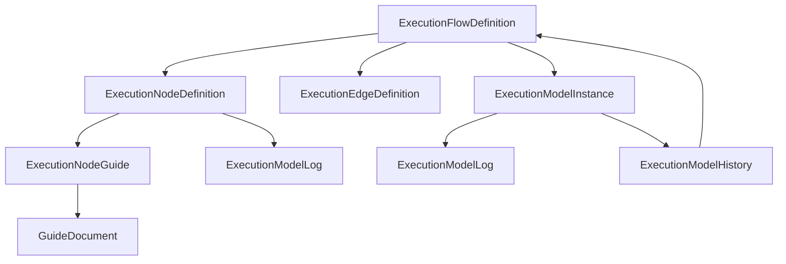
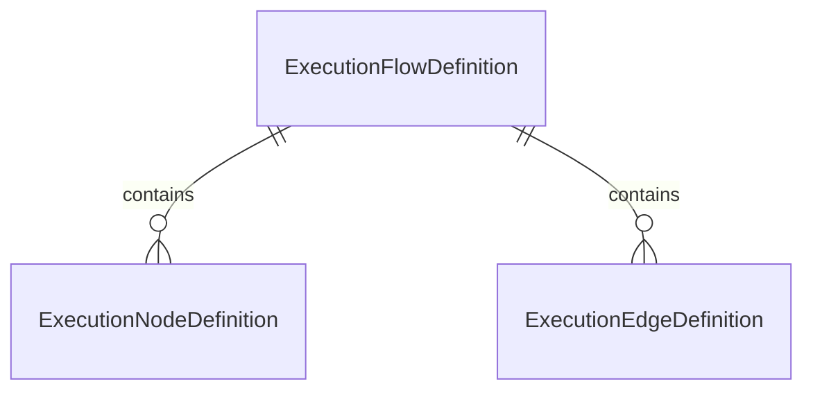
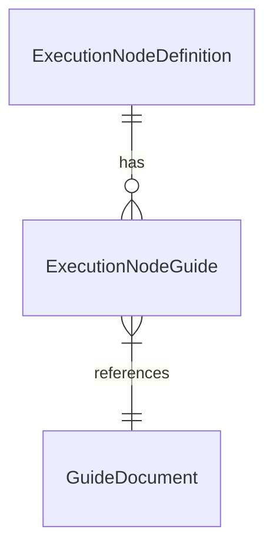
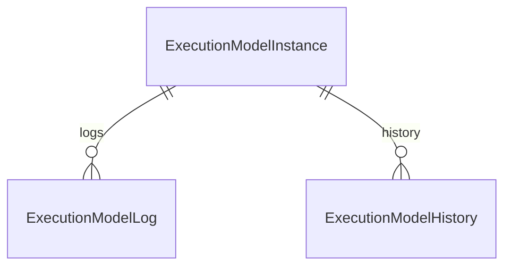
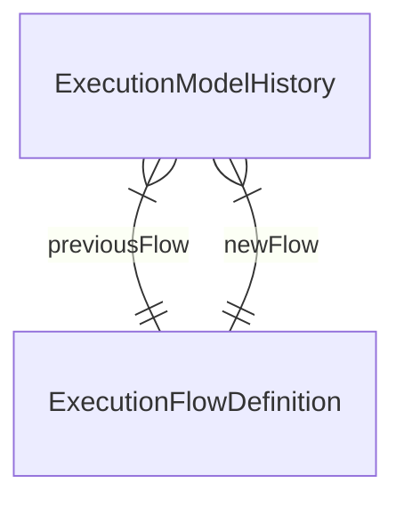
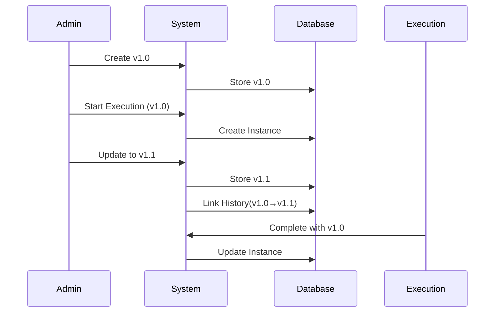

````markdown
# Workflow Execution System Documentation

## Core Concepts

### System Overview


````

## Component Breakdown

### 1. Core Workflow Definitions

```prisma
/// Workflow Template (Versioned)
model ExecutionFlowDefinition {
  id: String          @id @default(uuid())
  version: Int        @default(1)
  isActive: Boolean   @default(true)
  viewport: {
    x: Float
    y: Float
    zoom: Float
  }
}
```



### 2. Documentation System

```prisma
/// Node-Documentation Mapping
model ExecutionNodeGuide {
  applicationScope: String  @default("full")
  customInstructions: String?
  order: Int @default(1)
}
```



### 3. Runtime Execution Tracking

```prisma
/// Execution Instance
model ExecutionModelInstance {
  status: String // draft|queued|running|completed|failed|archived
  referenceId: String // Business ID (e.g., "INV-2023-0456")
}
```



### 4. Version History Management

```prisma
/// Version Migration Record
model ExecutionModelHistory {
  previousFlow: ExecutionFlowDefinition?
  newFlow: ExecutionFlowDefinition
  reason: String // system_update|manual_override|error_recovery
}
```



## Versioning Strategy

### Flow Version Lifecycle



### Key Versioning Rules

1. **Immutable Templates**:
   ```typescript
   // Creating new version
   const newFlow = await prisma.executionFlowDefinition.create({
     data: {
       id: existingId,
       version: { increment: 1 },
       nodes: updatedNodes,
     },
   });
   ```
2. **Execution Binding**:
   ```typescript
   // Execution references specific version
   const execution = await prisma.executionModelInstance.create({
     data: {
       flowId: 'flow_123@2', // Explicit version
     },
   });
   ```

## Example Scenarios

### 1. Creating New Flow Version

```typescript
// 1. Create base version
const v1 = await prisma.executionFlowDefinition.create({
  data: {
    version: 1,
    nodes: [startNode, approvalNode],
    edges: [startToApprovalEdge],
  },
});

// 2. Create updated version
const v2 = await prisma.executionFlowDefinition.create({
  data: {
    id: v1.id,
    version: 2,
    nodes: [startNode, validationNode, approvalNode],
    edges: [startToValidationEdge, validationToApprovalEdge],
  },
});
```

### 2. Runtime Version Migration

```typescript
// During execution
await prisma.executionModelHistory.create({
  data: {
    executionId: ongoingExecution.id,
    previousFlowId: 'flow_123@1',
    newFlowId: 'flow_123@2',
    reason: 'Hotfix: Add data validation step',
  },
});
```

## Query Examples

### 1. Get All Versions of a Flow

```typescript
const flowVersions = await prisma.executionFlowDefinition.findMany({
  where: { id: 'flow_123' },
  orderBy: { version: 'desc' },
});
```

### 2. Audit Trail for Execution

```typescript
const auditTrail = await prisma.executionModelInstance.findUnique({
  where: { id: 'exec_789' },
  include: {
    logs: true,
    history: {
      include: {
        previousFlow: true,
        newFlow: true,
      },
    },
  },
});
```

## Data Retention Policy

| Data Type           | Retention Period | Cleanup Rule                    |
| ------------------- | ---------------- | ------------------------------- |
| Active Flows        | Indefinite       | Keep last 3 active versions     |
| Archived Executions | 5 years          | Annual purge of completed flows |
| Error Logs          | 2 years          | Compress after 6 months         |

## FAQ

### Q: How to handle old versions?

```markdown
- **Do NOT delete**: Maintain all versions for audit purposes
- **Archive inactive**: Mark `isActive = false` after 3 newer versions
- **Storage optimization**: Compress JSON configurations
```

### Q: Migrate running executions to new version?

```markdown
1. Create new version (v2)
2. For each affected execution:
   - Create History record (v1→v2)
   - Update execution flow reference to v2
3. Validate node compatibility
```

## Glossary

| Term                        | Description                                |
| --------------------------- | ------------------------------------------ |
| **ExecutionFlowDefinition** | Versioned workflow template                |
| **ExecutionModelHistory**   | Record of version changes during execution |
| **ExecutionNodeGuide**      | Contextual documentation links             |
| **sourceHandle**            | Conditional connection point               |

## Conclusion

Explicación clave:

Flujo Inmutable:

typescript
const newFlow = await tx.executionFlowDefinition.create({
data: {
version: existingFlow ? existingFlow.version + 1 : 1,
// ...
}
});
Siempre crea nueva versión

Nunca modifica versiones existentes

Historial Contextual:

Diagram
Code

Relaciones Seguras:

executionId siempre será válido

Solo se crean registros cuando hay ejecuciones activas

Cumple con las restricciones de tipo de Prisma

Caso de uso ejemplo:

Request existente con categoría 241FD5CD... está en progreso

Creas nueva versión del flujo

El sistema:

Detecta el request activo

Crea nueva versión del flujo

Registra en el historial vinculando el executionId específico

La ejecución continúa con la versión anterior

Ventajas:

✔️ Cumple con el principio de inmutabilidad

✔️ Mantiene consistencia de tipos

✔️ Historial accionable y relevante

✔️ No afecta ejecuciones existentes

¿Necesitas ajustar algún aspecto específico de esta implementación?
